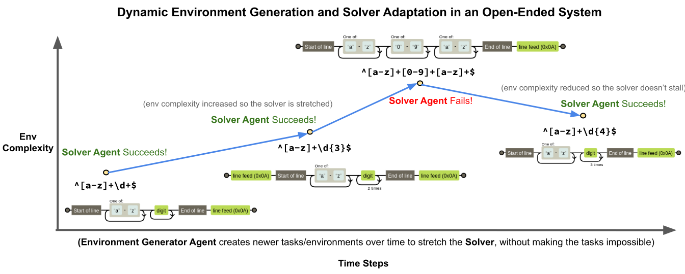

# Generating an Autonomous Curriculum for Formal Languages via Open-Ended Discovery

This project is an implementation of a closed-loop, autonomous system that demonstrates **Open-Ended Discovery**. It features two co-evolving Large Language Model (LLM) agents—a **Problem Generator** and a **Regex Solver** - that work together to explore the domain of regular expressions (a formal language). The system autonomously generates a curriculum of challenges, pushing the Solver to master increasingly complex formal patterns without direct human intervention.

The core idea is to move beyond static training and build a self-improving ecosystem where the act of learning itself generates new knowledge and capabilities.

### The Discovery Process in Action

The system doesn't just get better; it actively explores, sometimes overreaching and then adapting. This dynamic creates a curriculum tailored to the agent's evolving abilities. The `regex_progression.svg` image below shows a real trajectory from a run of this system, visualizing how the complexity of the discovered regular expressions increases over time.



### System Architecture

The project's architecture is designed as a co-evolutionary feedback loop, guided by principles from algorithms like **POET** and **Quality-Diversity (QD)**. The Generator creates challenges, the Solver attempts to solve them, and the outcome is used to update the system's shared memory, which in turn informs the next cycle of creation.



## Core Concepts

*   **Co-evolving Agents:** A **Problem Generator Agent** acts as the dynamic environment, creating novel puzzles. A **Solver Agent** acts as the learner, attempting to master these puzzles.
*   **Quality-Diversity (QD) Archive:** The system maintains an archive of all successfully solved problems, categorized by the concepts they use (e.g., "grouping", "backreferences"). This ensures the system explores a wide *variety* of challenges, not just a single path of increasing difficulty.
*   **In-Context Learning via Similarity Search:** The Solver "learns" without any weight updates. Before attempting a new problem, a **k-NN Similarity Ranker** finds the most semantically similar solved examples from the QD Archive. These examples are provided to the Solver as few-shot prompts, giving it relevant context to solve the new challenge.

## Getting Started

### Prerequisites

*   Python 3.10+
*   An environment variable `GOOGLE_API_KEY` set up for the embedding model and LLM.

### Installation

This project uses `uv` for fast and reliable package management.

1.  **Clone the repository:**
    ```bash
    git clone https://github.com/your-username/open-ended-discovery.git
    cd open-ended-discovery
    ```

2.  **Install `uv` (if you don't have it):**
    ```bash
    pip install uv
    ```

3.  **Create and activate a virtual environment:**
    ```bash
    uv venv
    source .venv/bin/activate
    ```

4.  **Install dependencies:**
    ```bash
    uv pip install -r requirements.txt
    ```

## How to Run

To start the open-ended discovery process, simply run the main script from the root directory:

```bash
python src/main.py
```

You will see a detailed log in your console showing the round-by-round interactions between the Generator and the Solver, including successes, failures, and the logic of the POET and QD components.

## Project Structure

```
open-ended-discovery/
├── architecture.svg            # Diagram of the system's algorithmic flow
├── README.md                   # This file
├── requirements.txt            # Project dependencies for uv/pip
└── src/                        # Main source code
    ├── data_structures.py      # Defines the Problem, Solution, and QD Archive classes
    ├── harness.py              # The objective, non-AI evaluation engine
    ├── llm_agents.py           # Contains the prompts and logic for Generator and Solver agents
    ├── main.py                 # The main script that orchestrates the discovery loop
    └── similarity_ranker.py    # Handles semantic search for in-context learning
```

## Outputs

After a run completes, you will find the following in the `results/` directory:

*   **`evolution_log.csv`**: A comprehensive log file detailing the events of each round.